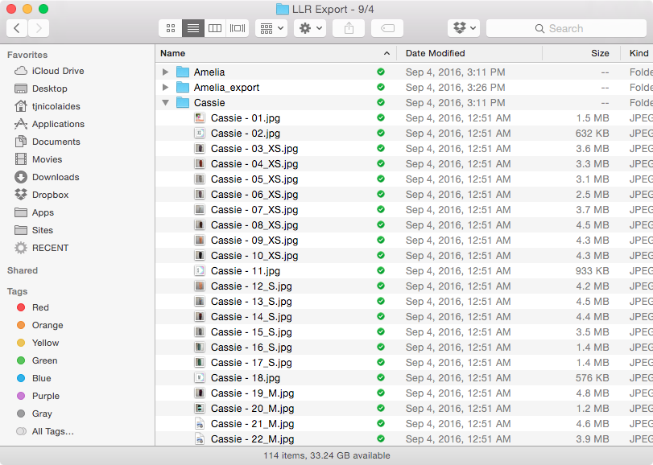
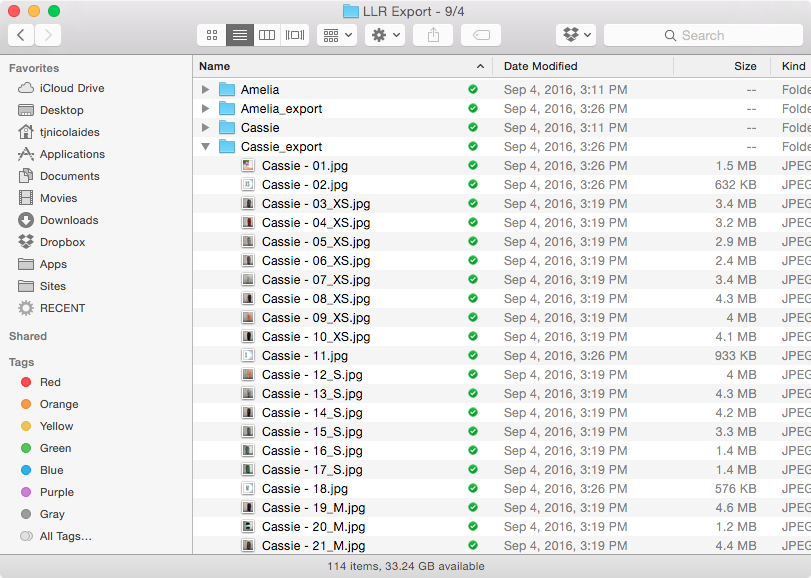

# LuLaRoe Image Watermarking Script
A shell script for OS X or Linux users to easily apply watermarks to LuLaRoe promotional images in large batches. Apply nice-looking labels for your many LuLaRoe promotional images in just minutes. 

If this little script saves you lots of time, please consider swinging by [Lauren's LuLaRoe Facebook group](https://www.facebook.com/groups/LuLaRoeLaurenNicolaides/) and saying hi!

## Usage
Run the script from your terminal, like this:

``` bash
./caption.sh ~/path/to/your/image/directory
```


The script expects specifically formatted filenames, and at this time processes images with the `.jpg` file extension only. Consider the following directories and filenames (which we got by exporting albums from iPhoto): 

* /path/to/your/image/directory/Cassie/
    * Cassie - 01.jpg
    * Cassie - 02.jpg
    * Cassie - 03_.jpg
    * Cassie - 04_XS.jpg
* /path/to/your/image/directory/Irma/
    * Irma - 01.jpg
    * Irma - 02.jpg
    * Irma - 03_.jpg
    * Irma - 04_M.jpg



After the script runs, it will create directories with `_export` appended to the names. Source images with `_` underscores in the filenames will have watermarks applied. Source images without underscores will be copied over to the new destination directory without being modified.



## Install
This script requires [ImageMagick](http://www.imagemagick.org/script/index.php) to convert images.

I use [Homebrew](http://brew.sh/) to install ImageMagick on OS X. If you are using Homebrew too, use `brew install imagemagick`. 

Links and instructions for other methods of installing ImageMagick on Windows, Mac OS X, or Linux are available on their site: http://www.imagemagick.org/script/binary-releases.php. 

At this time, the script has only been tested on OS X. Your mileage may vary. [Contributions are welcome](contributing.md) if you modify the script to work in other environments.

## Customize
### Primary Label
First, you will want to change the primary label, which currently reads "[LuLaRoe Lauren Nicolaides](https://www.facebook.com/groups/LuLaRoeLaurenNicolaides/)." Search for the line in `caption.sh` called `PRIMARYLABEL="LuLaRoe Lauren Nicolaides"` and enter your own.

### Color and Background Color
Change the text color and the semi-transparent background overlay color by changing these `rgba` values in `caption.sh`:
```bash
# text color
COLOR="rgba(255,255,255,1)"
# overlay background color
BACKGROUNDCOLOR="rgba(0,0,0,0.6)"
```

### Font 
Change the font by updating the following line in `caption.sh` to point at a font file installed on your computer, like:
```bash
# text font family
FONT="/System/Library/Fonts/HelveticaNeue.dfont"
```

### Secondary Label
The filename of your JPG images matters here. Given a filename like `Tall and Curvy - 14_.jpg`, the script will take the characters before the hyphen `-` and use them as the secondary label:


If you want to designate the size of the clothing in the secondary label, you can add characters after the underscore `_` in the filename (example: `Cassie - 04_XS.jpg` and they will be appended in the image like so:


## Bugs, feature requests, and support
Please raise bugs, ask for help, and make feature requests in the 'Issues' tab of our Github repository [here](https://github.com/tjnicolaides/lularoe_batch_watermark/issues). 

## Resources
* [ImageMagick](http://www.imagemagick.org/script/index.php)
* [How to run shell scripts - Ask Ubuntu](http://askubuntu.com/a/38670)

## License
This project, while authored for LuLaRoe consultants, is not affiliated with LuLaRoe in any way.
MIT © [TJ Nicolaides](https://tjnicolaides.com)